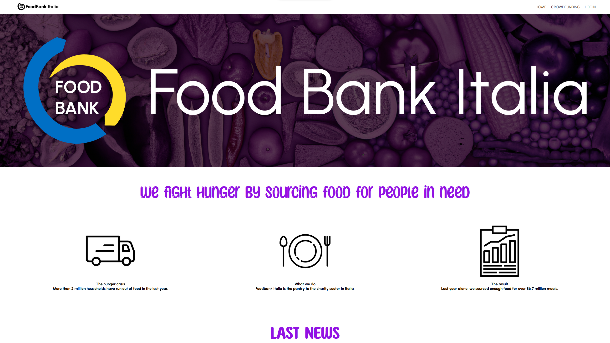

# Foodbank Italia

#### Live Demo:

You can test the it on [THIS SITE](https://saw21.dibris.unige.it/~S5066337/foodbanksaw/)!

---

#### Idea:

This is a template designed to be used by a foundation, it comes from a university project done in collaboration with my other colleagues

---

#### Features:

- Newsletter

- Donation backend management

- Checks on user input:
  
  - Email validation
  
  - Card ID validation (Italy)
  
  - Double password confirmation

- Encrypted passwords on DB

- The site is responsive

- Prevent SQL injection

---

#### Prerequisites:

- PHP
- A site (obviously)
- A database (I use MySQL)

---

#### Installation:

1. Create a database with respective tables

2. Create an email to use for the newsletter

3. Insert the various data into the files **connection.php** and **newsletter/sendEmail.php**

4. That's all folks!

